# Forest Fire Detection and Alert System

## Methodology for Implementation

The methodology for the implementation of this IoT system is showcased as a clear and detailed flowchart below.

### Flowchart

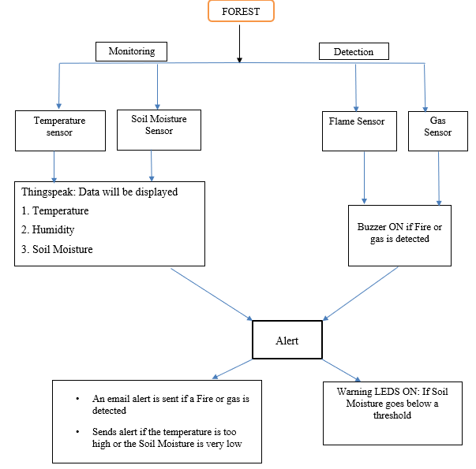

---

## Hardware Prototype Layout

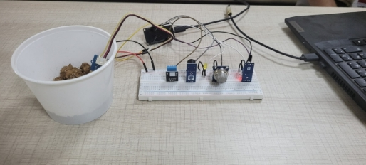
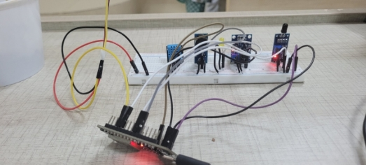
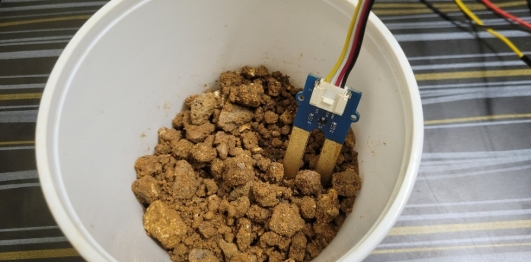

---

## Schematic Diagram

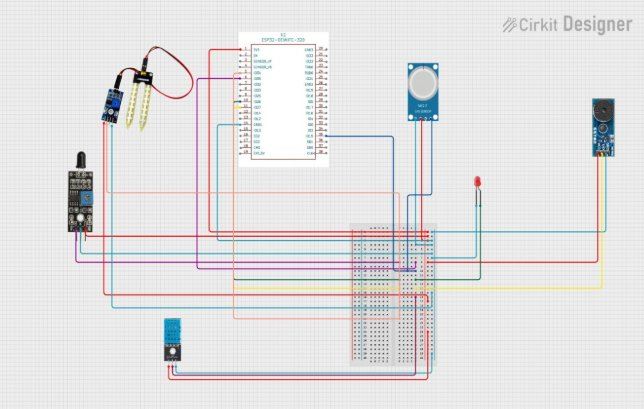

---

## Showcasing Results by Stages

### 1. Sensor Readings on Serial Monitor

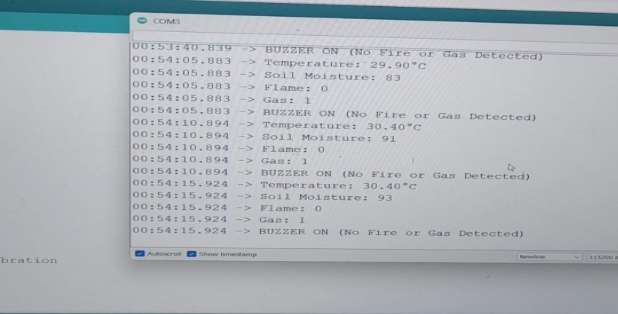

### 2. Data Display on ThingSpeak Cloud Platform

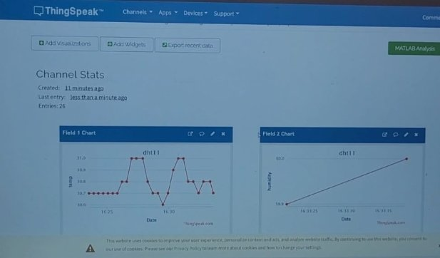

### 3. LED Alert for Low Soil Moisture Level

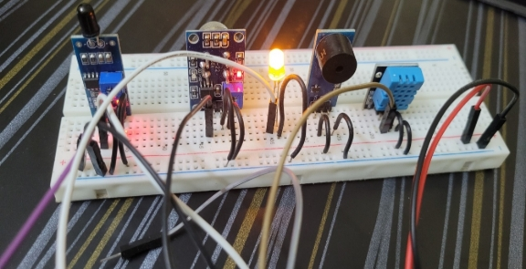

When the soil moisture sensor detects low moisture levels, the LED turns ON as an alert.

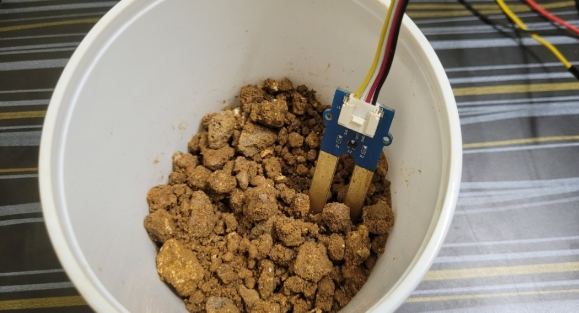

### 4. Email Alert When Fire or Gas is Detected

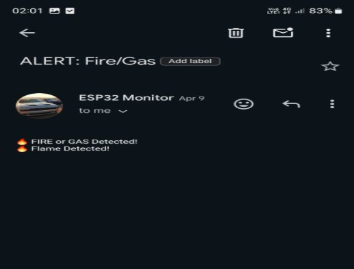

When soil moisture drops too low or temperature becomes too high, an automatic email alert is sent.

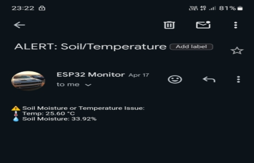

---

## Final Conclusion

The mini project on detecting forest fires provided practical learning in real-time environmental monitoring and disaster management using IoT technology. It demonstrated how small-scale innovations, when thoughtfully designed, can make a substantial impact in solving global issues like environmental protection and public safety.

This project also highlighted the importance of interdisciplinary solutions, combining electronics, computer science, and environmental science to address real-world problems.

---

## Result

The IoT-enabled Forest Fire Detection and Alert System has been successfully designed and tested using FreeRTOS (Real-Time Operating System) based code, ensuring rapid system response to real-time scenarios efficiently.
